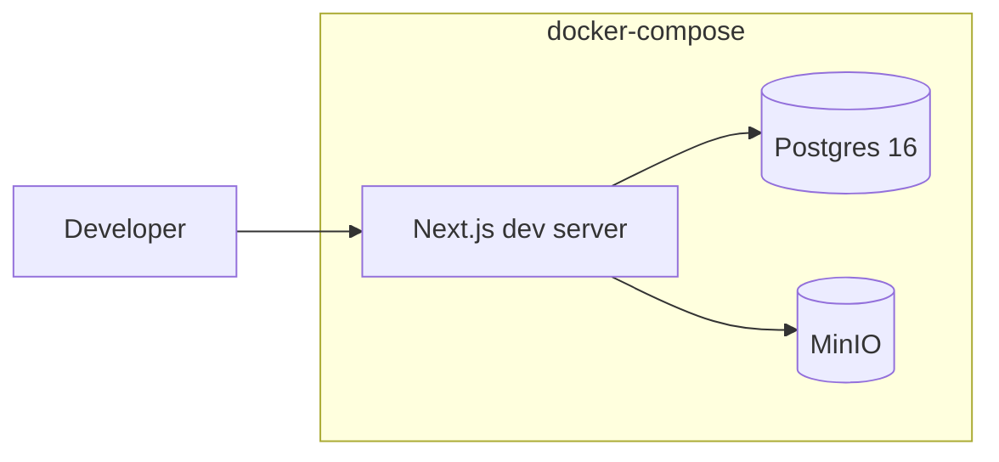
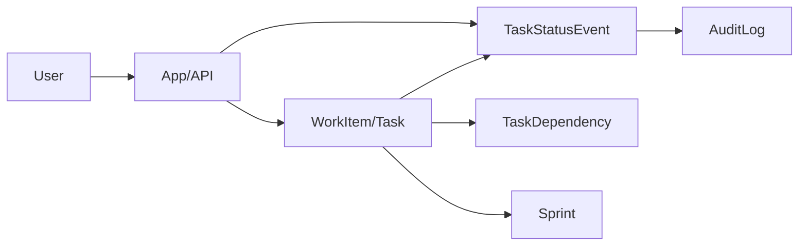
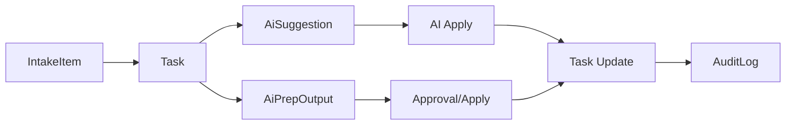

# Architecture (Draft)

## Production (AWS / EC2)
```mermaid
flowchart LR
  User[User/Client] --> ALB[ALB (HTTP)]
  subgraph AWS[VPC (ap-northeast-3)]
    ALB --> EC2[EC2 App (Next.js/Node + cron)]
    EC2 --> RDS[(RDS PostgreSQL)]
    EC2 --> S3[(S3 Avatar Bucket)]
    SM[Secrets Manager] --> EC2
    EC2 --> Metrics[Daily Metrics Job (uv + python, cron)]
    Metrics --> RDS
  end
```

## Local Dev (docker-compose)


## Processing Flows

### Plan/Execute/Review Navigation
```mermaid
flowchart LR
  Home[/] --> Backlog[/backlog (Plan)]
  Backlog --> Sprint[/sprint (Execute)]
  Sprint --> Review[/review (Review)]
  Review --> Backlog
```

### Task Lifecycle + Status Events


### Daily Metrics -> Memory Update
```mermaid
flowchart LR
  Cron[EC2 cron] --> Job[Metrics Job (uv + python)]
  Job --> Read[Query Task + TaskStatusEvent]
  Read --> Metric[MemoryMetric (window)]
  Metric --> Claim[MemoryClaim (EMA)]
```

### AI Collaboration Flow


### Focus Queue Computation
```mermaid
flowchart LR
  Tasks[Tasks + Dependencies] --> Score[Priority Score]
  Metrics[MemoryMetric] --> Score
  Score --> Focus[FocusQueue (Top 3)]
```
